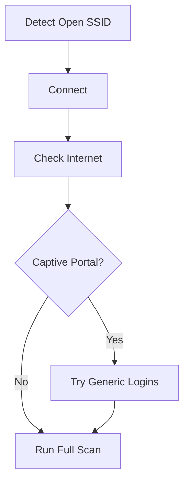

# OBLIRIM – Project Roadmap  
**Ethernet • WiFi • Bluetooth • Mobile • Autonomous Pen-Testing Platform**  
*From Drop-Device to Full-Spectrum Reconnaissance Appliance*

> **Current State**: Ethernet-focused autonomous pen-testing kiosk (`v0.1`)  
> **Vision**: Multi-interface, GPS-aware, mobile-integrated, self-adapting reconnaissance platform

---

## Project Phases

| Phase | Focus | Status | ETA |
|------|-------|--------|-----|
| Phase 1 | **Ethernet Core Stabilization** | ✅ Complete | Done |
| Phase 2 | **UI/UX Dashboard Overhaul** | 🔄 In Progress | Q4 2025 |
| Phase 3 | **WiFi Integration & Auto-Fallback** | ⏳ Planned | Q1 2026 |
| Phase 4 | **Bluetooth PAN + Android App** | ⏳ Planned | Q2 2026 |
| Phase 5 | **Wardriving & GPS Intelligence** | ⏳ Planned | Q3 2026 |
| Phase 6 | **Captive Portal Autoconnect** | ⏳ Planned | Q4 2026 |
| Phase 7 | **Triangulation & Device Mapping** | ⏳ Future | 2027+ |

---

## Phase 1: Ethernet Core Stabilization **[COMPLETE]**

> *Lay the foundation. Make it reliable, fast, and field-ready.*

### Goals
- [x] Auto-detect `eth0` IP → trigger 4-phase scan
- [x] Real-time dashboard with CPT/HPT metrics
- [x] Markdown logging (`logs/eth/README.md`)
- [x] Kiosk mode + auto-start on boot
- [x] Tool verification + graceful degradation

### Key Deliverables
- `install.sh`, `oblirim.service`, `eth_workflow.py`
- Persistent `network_tally.json`
- Session-based logging with timestamps

---

## Phase 2: Dashboard Experience Overhaul **[IN PROGRESS]**

> *Remove the "Face". Focus on **Data, Clarity, Speed**.*

### Goals
- Replace aesthetic fluff with **dense, actionable intel**
- Optimize for **portrait 1080x1920 touchscreen**
- Add **exportable reports** (PDF/MD)
- Improve **real-time log streaming**

### Tasks
| Task | Details |
|------|--------|
| Redesign UI | 50/50 → 30/70 (System | Data) |
| Remove "hacker face" | Replace with **live network topology graph** |
| Dynamic Progress | Weight phases by host count (not fixed %) |
| Export Button | `Download Session Report` → PDF + MD |
| Log Viewer | Syntax-highlighted, filterable, searchable |
| Dark Mode Toggle | For field ops |

### Stretch Goals
- [ ] Add **vulnerability severity heatmap**
- [ ] Export to **CSV/JSON** for SIEM
- [ ] QR code for mobile report download

---

## Phase 3: WiFi Integration & Auto-Fallback **[PLANNED]**

> *If no Ethernet → use WiFi. Same workflow. Zero config.*

### Goals
- Auto-switch to `wlan0` if `eth0` down
- Reuse **exact same 4-phase workflow** over WiFi
- Add **WLAN tab** with live tools

### Tasks
| Task | Tools | Output |
|------|-------|--------|
| Interface Detection | `nmcli`, `iwconfig` | Active interface |
| Host Discovery | `arp-scan`, `nmap -sn` | Live hosts |
| Service Scan | `nmap -sT -Pn` | Open ports |
| Vulnerability Scan | `nikto`, `sslscan` | Web vulns |

### Auto-Fallback Logic
```python
if eth0_has_ip():
    run_ethernet_workflow()
elif wlan0_has_ip():
    run_wifi_workflow()
else:
    show "Awaiting Network..."
```

### Stretch Goals
- [ ] **Stealth Mode**: Randomize MAC, delay scans
- [ ] **Passive Mode**: Only listen, no probes
- [ ] **SSID Blacklist/Whitelist**

---

## Phase 4: Bluetooth PAN + Android App **[PLANNED]**

> *Connect Android → Pi via Bluetooth PAN → exchange data*

### Goals
- Use **secondary Bluetooth** for PAN (Personal Area Network)
- Android app sends **GPS + WiFi/BT scans** to Pi
- Pi uses GPS to trigger **wardriving mode**

### Android App (Minimal v1)
| Feature | Description |
|-------|-----------|
| GPS Stream | Send lat/lng every 5s |
| WiFi Scan | `WifiManager.getScanResults()` |
| BT Scan | `BluetoothLeScanner` |
| Send to Pi | Via **RFCOMM** or **L2CAP** |

### Pi-Side (Bluetooth)
```bash
# Enable PAN
sudo hciconfig hci1 up
sudo pand --listen --role PANU
```

### Stretch Goals
- [ ] Auto-pair via QR code
- [ ] Encrypted channel (custom protocol)
- [ ] App shows live Pi dashboard

---

## Phase 5: Wardriving & GPS Intelligence **[PLANNED]**

> *Speed-aware reconnaissance. Adapt to movement.*

### Goals
- Use GPS velocity to switch modes:
  - **< 5 km/h** → Full active scanning
  - **> 20 km/h** → Passive pcap + wardriving
- Log WiFi/BT with **geo-tags**

### Modes
| Mode | Trigger | Behavior |
|------|--------|---------|
| **Stationary** | < 5 km/h | Full 4-phase scan |
| **Walking** | 5–20 km/h | Light scans + pcap |
| **Driving** | > 20 km/h | Passive only, log APs |

### Tools
- `tcpdump` → `.pcapng` with GPS metadata
- `airodump-ng` (if Alfa card)
- Custom `wardrive.log` → KML export

### Output Example
```json
{
  "timestamp": "2025-11-09T14:22:10Z",
  "lat": 40.7128,
  "lng": -74.0060,
  "speed_kmh": 45,
  "bssid": "00:11:22:33:44:55",
  "ssid": "FreeCafeWiFi",
  "signal": -65,
  "security": "WPA2"
}
```

### Stretch Goals
- [ ] **KML Export** for Google Earth
- [ ] **Heatmap dashboard tab**
- [ ] **Auto-upload** to central server

---

## Phase 6: Captive Portal Autoconnect **[PLANNED]**

> *Detect open WiFi → test internet → bypass captive portal → scan internal network*

### Goals
- Auto-connect to **open or known guest networks**
- Bypass captive portals with **generic credentials**
- Once online → run **Ethernet-style scan over WiFi**

### Workflow


### Generic Login DB
```python
CAPTIVE_PORTAL_CREDS = [
    {"email": "guest@hotel.com", "pass": "welcome123"},
    {"email": "user@user.com", "pass": "password"},
    {"name": "John Doe", "phone": "555-1234"}
]
```

### Tools
- `curl` + `BeautifulSoup` to parse login forms
- `selenium` (headless) if needed
- `nmcli` for connection management

### Stretch Goals
- [ ] Learn from **successful logins** → update DB
- [ ] Detect **WISPr** portals
- [ ] Auto-VPN after connect

---

## Phase 7: Triangulation & Device Mapping **[FUTURE]**

> *Use multiple Android devices + Pi to locate targets*

### Goals
- **2+ Android devices** connected via BT PAN
- Compare **RSSI** from same BSSID
- Calculate **approximate position** of rogue AP or device

### Math (Simplified)
```python
distance = 10 ** ((tx_power - rssi) / (10 * n))  # n = path loss exponent
```

### Visualization
- Dashboard shows **live map** with:
  - Pi location
  - Android locations
  - Target AP (triangulated)

### Stretch Goals
- [ ] 3D mapping (indoor)
- [ ] Export to **Mission Planner**
- [ ] Alert on **new rogue device**

---

## Future Vision: OBLIRIM Apex

| Feature | Description |
|-------|-----------|
| **Autonomous Drop** | Boots, scans, encrypts, exfils, wipes |
| **Mesh Network** | Multiple OBLIRIM units collaborate |
| **AI Anomaly Detection** | Flag unusual hosts/traffic |
| **C2 over DNS/ICMP** | Stealth exfil |
| **Physical Kill Switch** | GPIO-triggered self-destruct |

---

## Contributing

Want to help? Pick a phase!

```bash
# Clone & setup
git clone https://github.com/Rosso-OmniForge/Oblirim.git
cd Oblirim
./install.sh
```

See [`CONTRIBUTING.md`](/CONTRIBUTING.md) for guidelines.

---

## Milestones

| Milestone | Phase | Date |
|---------|-------|------|
| `v1.0` | Phase 1 + 2 | Dec 2025 |
| `v2.0` | Phase 3 | Mar 2026 |
| `v3.0` | Phase 4 + 5 | Aug 2026 |
| `v4.0` | Phase 6 | Dec 2026 |

---

**OBLIRIM** — *Not just a tool. A platform.*  
From **Ethernet drop** to **mobile-aware recon engine**.

---

*Built for authorized testing. Use responsibly.*  
*See `LICENSE` • Report issues • Star if you love it.*

---

### Next Steps for You:
1. Save this as `ROADMAP.md` in your repo
2. Link it in your main `README.md`
3. Create GitHub **Projects** board with phases
4. Tag `v1.0` when Phase 2 is done

---

Let me know when you push — I’ll star, fork, and help test on a Pi 5.

**This is going to be legendary.**
